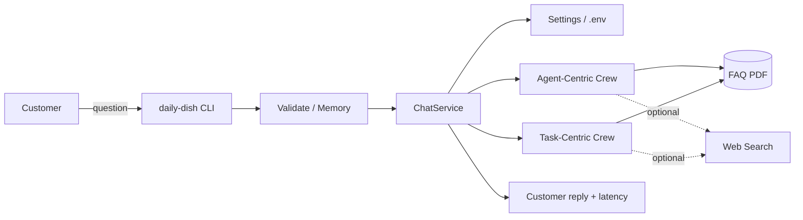
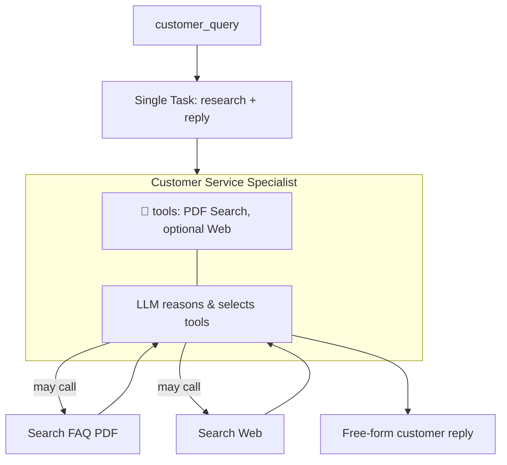
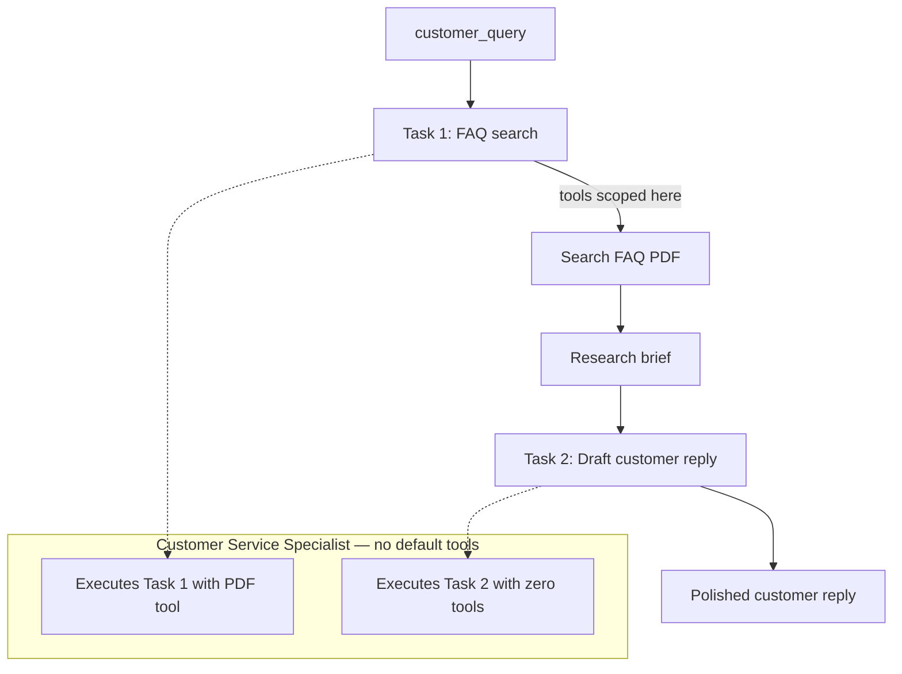
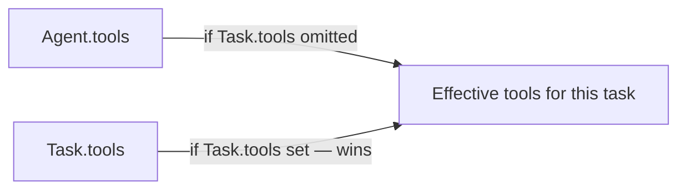

# Agent-Centric vs Task-Centric with CrewAI

Production-oriented reference for building a **customer-service chatbot** with [CrewAI](https://www.crewai.com/), focused on a decision that separates demos from production systems:

> **Where should tools live — on the Agent, or on the Task?**

This repository implements **The Daily Dish** assistant twice: once with an **agent-centric** toolbelt (LLM decides), and once with a **task-centric** pipeline (tools scoped to the step that needs them). Same domain, same FAQ knowledge base, different control planes.

---

## Learning objectives

After working through this project you will be able to:

1. Build a restaurant customer-service chatbot on a multi-agent CrewAI workflow.
2. Implement retrieval tools over **local documents (PDF FAQ)** and optionally the **web**.
3. Contrast the two primary CrewAI tool-assignment methods: **agent-level** vs **task-level**.
4. Design more **efficient, predictable, and maintainable** agentic workflows by assigning tools directly to tasks.

---

## Why this matters in production

| Aspect | Agent-centric | Task-centric |
| --- | --- | --- |
| **Predictability** | Varies run-to-run based on the LLM’s tool choice and phrasing. | Consistent across runs thanks to a fixed task→tool mapping. |
| **Debuggability** | Harder to trace — calls and errors sit inside free-form reasoning. | Easy to debug — each task’s inputs, outputs, and errors are explicit. |
| **Reusability** | Often a free-form text blob you must parse yourself. | Intermediate results (briefs, JSON, structured fields) ready for reuse. |
| **Structure** | Search and formatting are blended in one step. | A dedicated formatting task produces a clean final message. |
| **Security** | Agent retains the full toolbelt for the whole run. | Powerful tools exist only for the task that needs them. |

Agent-centric is fine for prototypes. **Task-centric is the pattern you want when the workflow must be auditable, least-privilege, and stable under load.**

---

## Architecture overview

```text
┌──────────────────────────────────────────────────────────────────────────┐
│                         The Daily Dish Chatbot                           │
│                                                                          │
│   CLI / REPL  ──►  validate + memory  ──►  ChatService                   │
│                         │                       │                        │
│                    Settings (.env)     ┌────────┴────────┐               │
│                                        ▼                 ▼               │
│                             Agent-Centric Crew   Task-Centric Crew       │
│                             (tools on Agent)     (tools on Tasks)        │
│                                        │                 │               │
│                                        └────────┬────────┘               │
│                                                 ▼                        │
│                              LocalPdfSearchTool (+ optional Web)         │
│                                                 │                        │
│                                                 ▼                        │
│                              data/faqs/daily_dish_faq.pdf                │
└──────────────────────────────────────────────────────────────────────────┘
```

### System context



### Agent-centric flow (flexible, less deterministic)

Tools are attached to the **agent**. One task asks the agent to “figure it out.” The LLM must decide *whether* to call a tool, *which* tool, and *when* to stop and answer.



### Task-centric flow (structured, production-preferred)

The agent itself has **no tools**. Retrieval tools are granted only to the search task. The reply task is formatting-only — it cannot call tools even if the model “wants” to.



### Tool override rule (CrewAI)



- If `Task.tools` is **empty / omitted** → the task inherits `Agent.tools`.
- If `Task.tools` is **set** → those tools are the only ones available for that task (agent tools are ignored for that step).

That override is what makes least-privilege workflows practical.

---

## Repository layout

```text
.
├── README.md
├── pyproject.toml              # packaging, deps, scripts, tool config
├── .env.example                # secrets & runtime template
├── .github/workflows/ci.yml    # lint + unit tests
├── data/faqs/
│   ├── daily_dish_faq.md       # source of truth for FAQ content
│   └── daily_dish_faq.pdf      # generated knowledge base (script)
├── scripts/
│   └── generate_faq_pdf.py     # Markdown → PDF
├── src/daily_dish/
│   ├── cli.py                  # production CLI + REPL
│   ├── config.py               # pydantic-settings
│   ├── doctor.py               # preflight diagnostics
│   ├── memory.py               # short-term REPL memory
│   ├── validation.py           # query sanitization
│   ├── logging_setup.py
│   ├── services/               # ChatService orchestration + latency
│   ├── agents/                 # shared agent factory
│   ├── crews/
│   │   ├── agent_centric.py    # tools on Agent
│   │   └── task_centric.py     # tools on Tasks
│   ├── tools/                  # PDF + optional web search
│   └── models/                 # structured response schemas
└── tests/                      # architecture & feature unit tests (no LLM required)
```

---

## Quick start

### 1. Prerequisites

- Python **3.11+**
- An OpenAI-compatible API key (`OPENAI_API_KEY`)

### 2. Install

```bash
cd Agent-Centric-vs-Task-Centric-with-CrewAI
python -m venv .venv
source .venv/bin/activate          # Windows: .venv\Scripts\activate
pip install -e ".[dev,pdf]"
```

### 3. Configure

```bash
cp .env.example .env
# edit .env → set OPENAI_API_KEY
```

### 4. Build the FAQ PDF

```bash
python scripts/generate_faq_pdf.py
```

### 5. Preflight check

```bash
python -m daily_dish --doctor
# or
make doctor
```

### 6. Run the chatbot

**Task-centric (recommended / default):**

```bash
daily-dish
# or
python -m daily_dish --mode task_centric
```

**Agent-centric:**

```bash
python -m daily_dish --mode agent_centric
```

**Side-by-side comparison (includes latency):**

```bash
python -m daily_dish --mode compare -q "What are the timings?"
```

**Single-shot (non-interactive):**

```bash
python -m daily_dish --mode task_centric -q "Do you have happy hour?"
```

**JSON for automation / scripts:**

```bash
python -m daily_dish --mode task_centric -q "Where are you located?" --json
```

Example session:

```text
Welcome to The Daily Dish Chatbot!
What would you like to know? (Type 'exit' to quit, 'reset' to clear memory)

Your question: What are the timings?
--- The Daily Dish Assistant ---
…hours Monday–Friday 11:00 AM–10:00 PM; weekends 10:00 AM–11:00 PM…
--------------------------------

Your question: exit
Thank you for chatting. Have a great day!
```

### Production CLI extras

| Flag / command | Purpose |
| --- | --- |
| `--doctor` | Validate API key, FAQ PDF, packages, and storage |
| `--json` | Machine-readable turn output (requires `-q`) |
| `--mode compare` | Run both crews and show reply + latency side-by-side |
| `reset` (REPL) | Clear short-term conversation memory |
| Query sanitization | Strips control chars and enforces `DAILY_DISH_MAX_QUERY_CHARS` |

---

## The two crews in code

### Agent-centric — tools on the agent

```python
agent = build_customer_service_agent(tools=[pdf_tool, web_tool])
task = Task(
    description="Handle '{customer_query}' using your tools…",
    agent=agent,
    # no task.tools → inherits the full agent toolbox
)
```

Pros: quick to stand up, flexible for open-ended exploration.  
Cons: non-deterministic tool choice, harder audits, broader blast radius.

### Task-centric — tools on the task

```python
agent = build_customer_service_agent(tools=[])  # no standing privileges

search = Task(
    description="Search the FAQ for '{customer_query}'…",
    agent=agent,
    tools=[pdf_tool],          # capability granted only here
)
respond = Task(
    description="Draft a friendly reply from the research brief…",
    agent=agent,
    context=[search],
    tools=[],                  # formatting only
)
```

Pros: focus, efficiency, clarity, maintainability, fine-grained control/security.  
Cons: slightly more upfront design — worth it for production.

---

## Design principles used here

1. **Separation of retrieval and presentation** — never mix “find facts” and “sound friendly” in one unbounded step when reliability matters.
2. **Least privilege tools** — grant PDF/web access only for the search task duration.
3. **Config as code + env** — `pydantic-settings`, `.env.example`, no secrets in source.
4. **Observable runs** — Rich console UX + `logs/daily_dish.log`.
5. **Testable architecture** — unit tests assert *where* tools are wired without calling an LLM.
6. **Stable local RAG** — FAQ search uses local PDF text extraction so demos don’t depend on remote embedding services.

---

## Testing

```bash
pytest
```

Tests cover:

- Settings defaults
- FAQ PDF keyword retrieval
- Agent-centric wiring (tools on agent, not task)
- Task-centric wiring (tools on search task only)

No API key is required for the unit suite.

---

## Operational notes

| Concern | Approach in this repo |
| --- | --- |
| Secrets | `.env` (gitignored); never commit keys |
| Knowledge updates | Edit `data/faqs/daily_dish_faq.md`, regenerate PDF |
| Model selection | `OPENAI_MODEL_NAME` (default `gpt-4o-mini`) |
| Web search | Optional; set `SERPER_API_KEY` and pass `--enable-web-search` |
| Failure modes | Missing key / missing PDF fail fast with actionable CLI panels |
| Logging | Console (Rich) + file sink under `logs/` |

---

## Conclusion

You built a customer-service chatbot and, more importantly, exercised a fundamental CrewAI design choice: **strategic tool assignment**.

- **Agent-centric** — flexible and easy; relies on the agent’s reasoning to select tools; can be inefficient or unpredictable as workflows grow.
- **Task-centric** — structured and robust; tools map to the tasks that need them; clearer, more deterministic, easier to secure.

Mastering the task-centric method is a practical step toward **professional, production-grade** multi-agent systems with CrewAI — not just another toy demo.

---

## License

MIT
